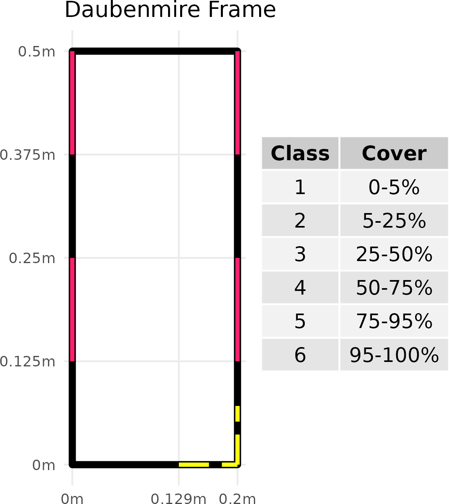
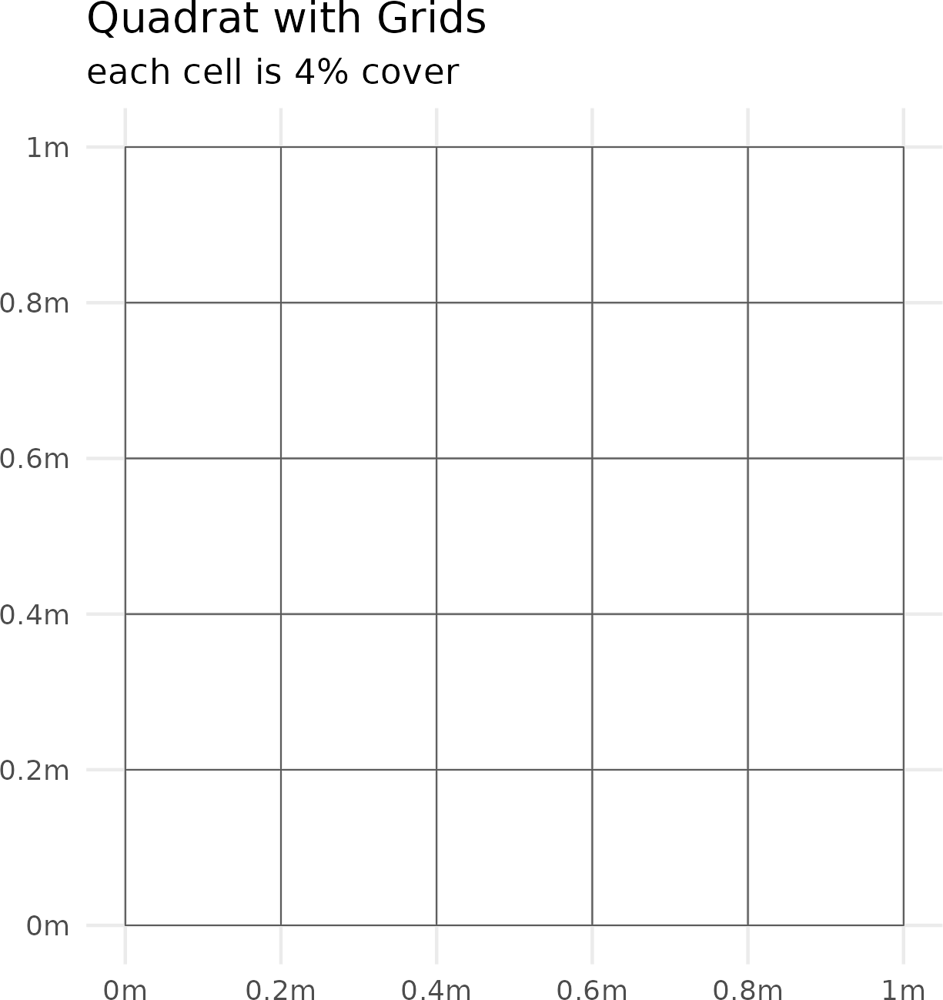
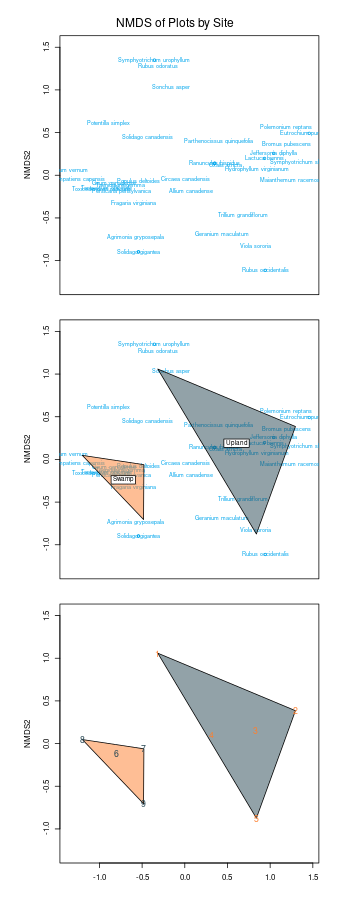

```{r setup, include=FALSE}
knitr::opts_chunk$set(echo = F)
knitr::opts_chunk$set(dpi = 300) 
knitr::opts_chunk$set(message = F)
knitr::opts_chunk$set(warning = F)
knitr::opts_chunk$set(fig.align="left") 
```

```{r load libraries}
library(tidyverse) # used for data transformations and processes. 
library(rstatix) # used for simple statistical analyses. 
library(iNEXT) # used for rarefaction analysis. 
library(vegan) # used for NMDS 
library(sf) # used for making example plots
set.seed(12) # to get similar results from runs of the NMDS analysis 
source('functions.R') # load a few small functions for processing the data. 
```

## Why do we monitor vegetation?  

- Many plant species respond quickly to land management actions   
- Indicators of whether an area is moving in a more-or-less desirable direction 
- Inform us whether a management action needs to be abandoned, increased, or maintained  
- **Serve as the main constituent of habitat quality**  
- Note we will **not** cover demography today. 

## What variables are typically monitored? 

-  **Absolute & Relative Cover** *How much of an area has vegetation? How is this cover composed by species and functional groups?*  
  - preventing erosion, characterizing habitat.   
- **Abundance, Frequency, Density**  *Are individual plants becoming patchier in areas? Is the population declining?*  
  - Are actions too concentrated to microsites? Is a valuable resource declining?  
- **Diversity** *How many species are there? How are their abundances distributed? Is an area down to only a few species?*  
  - Overall ecosystem integrity, assessing conservation priorities.   


## How do we measure plant absolute cover?
<div style="float: left; width: 70%;"> 
- Depends on vegetation type, and annual climatic variability 

- Forest  
  - Line Intercept 
- Grassland & Savannah  
  - Line Intercept  (LI) &  Line-Point Intercept (LPI)  
  - (Historic) Daubenmire  
- Small plants!  
  - Grids with equal area cells  
  - most subjective of the methods  
  - complicated by time of sampling    
</div>

<div style="float: right; width: 30%;"> 
<div class="centered">
```{r LPI & Line Intercept, out.width = "150px", out.height= "150px"}
knitr::include_graphics('./images/AIM-plot.png')
```

```{r Daubenmire Frame, out.width = "150px", out.height= "150px"}

```

```{r Quadrat with cells, out.width = "150px", out.height= "150px"}

```

</div>
</div> 

## How do we measure plant abundance, frequency, and density? 

<div style="float: left; width: 70%;"> 
- Belt Transects (abundance)  
  - plants are very sparse - pop. census size  
  - set up around LPI transects  
- Nested Quadrats (frequency)  
  - monitor multiple species simultaneously - spatial distribution / stability of populations  
  - Daubenmire frames also used  
- Quadrats (density)  
  - plants are moderately abundant - pop. census size,  spatial distribution  
</div>

<div style="float: right; width: 30%;"> 
<div class="centered">
```{r Belt Transect, out.width = "100px", out.height= "200px"}

```

```{r Nested Quadrat, out.width = "225px", out.height= "225px"}
knitr::include_graphics('./images/nested.png')
```
</div>
</div> 

## How do we measure diversity? 

<div style="float: left; width: 60%;"> 
- Can be done by wandering around areas... 
- Quadrats   
  - Generally *much* larger than in other types of sampling  
  - Fewer replicates  
- Oriented to follow environmental gradients   
- The gold standard: Modified Whittaker
  - MW has two less intensive follow-up variants, the 'Intensive' and 'Extensive' 
  - I&E plots can characterize microhabitats (use determined via rarefaction)  
  - takes a long time... 
</div>

<div style="float: right; width: 40%;" class = 'centered'> 
<center>
```{r Modified Whittaker Plot, out.width='95%'}

```
</center>
</div>

## What is a Floristic Quality Assessment? 
<font size="4">

> _'... tolerance of anthropogenic disturbance and exclusivity to remnant habitats are the only validated criteria for defining FQA.'_
> 

> _'...FQA conveys two things about high conservative species: (1) All else being equal, they have greater conservation value, and (2) they reflect a site’s history of minimal disturbance and degradation.'_
>
> `r tufte::quote_footer('--- Spyreas 2019')`

</font>

- Different species and sites have different tolerances to recovery after anthropogenic disturbances  
- Useful for identifying high-quality remnant habitat  
- Essentially a format for prioritizing land management decisions, especially active management 
- We know we cannot restore everywhere, preventing degradation is key, we can shift certain activities to areas of less conservation values  

## What do C-values mean? 

- Vary by each administrative unit they are generated for  
- Reflect the *purpose* of monitoring  

<font size="4">

> _'... the coefficient applied to each taxon represents a rank based on observed
behavior and patterns of occurrence in Illinois plant communities and our confidence that a taxon is remnant
(natural area) dependent._   

> _Species given a C value of **0-1** are taxa adapted to severe disturbances, particularly
anthropogenic disturbances..._   

> _Species with a C value of **2-3** are associated with somewhat more stable, though degraded,
environments._   

> _Species with coefficients **4-6** include many dominant or matrix species for several habitats;
they have a high consistency of occurrence within given community types._ 

> _Species with C values **7-8** are taxa we associate mostly with natural areas, but that can be found persisting where the habitat has been degraded somewhat._    

> _Species with coefficients **9-10** are considered to be restricted to high-quality natural areas.'_    
> 
> \hfill `r tufte::quote_footer('--- Taft et al. 1997')`

</font> 

## Calculations

Mean Coefficient of Conservatism
$$
\overline{C} = \frac{\sum{} C_i}{S}
$$
<font size="3">
<center>
  - $C_i$ in particular $C$ is the Conservatism Value (C-Value), for each $_i$ of the $S$ at the site  
  - $S$ is the number of species included in the calculation  
  - $\overline{C}$ is the Mean Coefficient of Conservatism, or for short *Mean C*  
  - $\sum{}$ is an operator, meaning that we will sum all C-Values, $C$  
</center>
</font>

Floristic Quality Index
$$
FQI = \overline{C} * \sqrt{S}
$$
<font size="3">
<center>
  - $\overline{C}$ is the Mean Coefficient of Conservatism, or for short Mean C  
  - $\sqrt{S}$ is the square root of the number of species included in the calculation  
</center>
</font>

## What do we mean by Species Richness?   

<div style="float: left; width: 50%;"> 
- The number of plant taxa in an area; also referred to as $\gamma-\text{diversity}$  
- Measuring it is time intensive, as many plants are locally rare  
- Understanding progress of sampling via rarefaction   
</div>

<div style="float: right; width: 50%;"> 
- $\gamma-\text{diversity}$, and it's measurement, is influenced by:   
  - number of species per habitat ($\alpha-\text{diversity}$)    
  - turnover in species between habitats ($\beta-\text{diversity}$) 
</div>
<div style="clear: both;"></div>

<div class="centered">
```{r Create Diversity Representation, out.width = "700px", out.height= "250px"}

```
</div>

## Reading Plots  
<div style="float: left; width: 70%;"> 
- Boundary Decisions  
  - Are plants rooted in the plot? 
  - Which side of the plots are plant rooted in?  
- Order to reading?   
  - Nested quadrats go from smallest to largest plot  
    - Only record *new* species along the way  
    - If same species is present in '2' as in '1' do not record.  
- Avoiding double counting  
  - search methodically following a single direction  
  - Avoid trampling  
- Search in 1/2m wide swaths  
</div> 

<div style="float: right; width: 30%;"> 
<font size="4">
```{r Boundary Decisions, out.width = "350px", out.height= "350px", fig.cap='Colored areas are "In" a plot.'}

```
</font>
</div>
<center>

## Management Decisions - Species Cover 

<div style="float: left; width: 60%;"> 
- Cover of species naturally ebb and flow  
- Certain management actions can increase cover of some species, while vastly decreasing cover of others  
- Many of the decreasing species may be important for wildlife, or ecosystem function (e.g. water retention, soil stability)  
</div>

<div style="float: right; width: 40%;"> 
<font size="4">
```{r Cattle Movement, out.width = "400px", out.height= "350px", fig.cap='Rotating cattle near Wisdom MT. *Agricultural Funders News*'}

```
</font>
</div>
<center>

## Management Decisions - Vegetation Similarity 

<div style="float: left; width: 70%;"> 
- If we want to *restore* an area, what is our target?  
  - Example: We may want X% absolute cover of broad leaved shrubs w/ < X% relative cover of species Y  
  - But *where* do we get these standards from?  
- Reference site, an area with similar soils & climate to our site   
  - altered site should be able to produce a veg community similar to the reference   
- Can we expect areas with similar vegetation to respond similarly to management actions?  
  - e.g. fire, grazing cattle/sheep/goats, removal of invasives?  
  </div> 
  
<div style="float: right; width: 30%;"> 
<font size="4">
```{r Lanphere Dunes, out.width = "300px", out.height= "200px", fig.cap='Lanphere Dunes Preserve CA. Reference Site for Coastal backdunes in early seral state'}
knitr::include_graphics('./images/Lanphere.jpg')
```
</font>
</div>
<center>

## Management Decisions - Species Richness

- Ecosystem resilience often found to relate to the number of species in an area  
  - Loss of species may allow proliferation of invasive species  
- $\alpha-\text{diversity}$ let's us know whether we have a good representation of native species at site  
- $\beta-\text{diversity}$ let's us know that the site is not becoming more homogenous, i.e. breaking down  
- $\gamma-\text{diversity}$ let's us know species can recruit from local areas back to more disturbed areas  

## Management Decisions - FQA  

<div style="float: left; width: 60%;"> 
- Should areas with more remnant species be prioritized for active management? *and why* 
  - Some species cannot be 'added' back in via restoration  
  - These areas maybe managed to reduce further anthropogenic impacts, e.g. invasive removal, disallow certain recreation activities. 
  - Some areas with higher C-values likely to still harbor rare-species, impetus to survey. 

- Use Mean C, or FQI to detect these areas.  
</div>

<div style="float: right; width: 40%;"> 
<font size="4">
```{r Spray Weeds, out.width = "400px", out.height= "350px", fig.cap='Spraying Weeds Kenai Fjords AK *National Park Service*'}

```
</font>
</div>
<center>

## A Usage Example  

<div style="float: left; width: 60%;"> 
- See Benkendorf & Holsinger 2023  
- Ca. 250 plots of opportunistic species richness data, collected over 5 years    
- Ca. 860,000 acre area, use spatial statistics and regression techniques to identify features correlating with high FQI  
  - Decision: 
    - Do we restore areas at less than 7,000 feet? No, unless burned.  
</div>

<div style="float: right; width: 40%;"> 
<center> 
```{r show UFO Plots,  out.width = "300px", out.height= "275px"}
knitr::include_graphics('./images/FQI-plots.png')
```
```{r Show UFO Prediction, out.width = "300px", out.height= "275px"}
knitr::include_graphics('./images/FQI-prediction.png')
```
</center>
</div>

## Our activity for the early afternoon

<div style="float: left; width: 70%;"> 
- Compare two different parts of McDonald Woods, Upland White Oak & Swamp White Oak 
1) Assess how quadrats capture species richness   
2) Do sites differ in their Mean C, FQI, or Wetland Indicator status?   
3) Determine appropriate quadrat sizes for future monitoring  
3) Consider similarity of microhabitats across sites  
</div>

<div style="float: right; width: 30%;"> 
```{r Quad, out.height = '500px', out.width='375px'} 
 
```
</div>

## Methods 

<div style="float: left; width: 70%;"> 
- Record all 'eudicot' plant species rooted in nest #1   
   - Move to nest #2 and record only the species not found in nest #1  
   - Continue to do this for all 4 nests   
- After completing the nests, record all plant species not found in the nests, which are present in the final 1x1m square   
- Each person should be able to read a plot once, each person should record  
- DON'T WORRY ABOUT THE SPECIES IDs
</div>

<div style="float: right; width: 30%;"> 
<center>
```{r Showcase our Quadrat, out.height = '300px', out.width='250px'} 
 
```

```{r Example Data Entry, out.height = '200px', out.width='175px'} 
 
```
</center>
</div>

## Analyses 

- `r paste0('Carried out in ', R.version$version.string, ' on ', R.version$os)`  
- **iNEXT** (Chao et al. 2014, Hsieh et al. 2024) for rarefaction, used to assess sampling completeness.   
- **rstatix** (Kassambara 2024) for t.test, used to determine whether differences exist between sites.  
- **vegan** (Oksanen et al. 2024) for Non-metric multiDimensional Scaling (NMDS), are portions of sites more similar to each other 
- FQA Values, Taft et al. 1997, downloaded from https://universalfqa.org/ which may have FQA values for your area too! 

```{r Prep data for analyses}
cvals <- read.csv('./data/Taft1997FQA_Values.csv', skip = 11) %>% 
  
  # update some of the species names
  
  mutate(Scientific.Name = case_when(
    Scientific.Name == 'Circaea lutetiana v. canadensis' ~ 'Circaea canadensis',
    Scientific.Name == 'Polygonum pensylvanicum' ~ 'Persicaria pensylvanica',
    Scientific.Name == 'Isopyrum biternatum' ~ 'Enemion biternatum',
    Scientific.Name == 'Smilacina racemosa' ~ 'Maianthemum racemosum',
    Scientific.Name == 'Aster shortii' ~ 'Symphyotrichum shortii', 
    Scientific.Name == 'Aster sagittifolius' ~ 'Symphyotrichum urophyllum',
    Scientific.Name == 'Eupatorium purpureum' ~ 'Eutrochium purpureum', 
    .default = as.character(Scientific.Name)

  ))

data <- read.csv('./data/DataSheet.csv')
data <- left_join(data, cvals, by = c('Species' = 'Scientific.Name')) %>% 
  mutate(Species = str_trim(Species))

c_vals <- data %>% 
  group_by(Quadrat) %>% 
  mutate(
    Mcoc = mcoc(C), 
    FQI = fqi(C),
    Site = as.factor(Site),
      ) %>% 
 # distinct(Site, Quadrat, .keep_all = T) %>% 
  select(Site, Quadrat, Mcoc, FQI)

rm(cvals, mcoc, fqi)
```

## Analysis 1 - Are we capturing a representative amount of the species diversity? 

<div style="float: left; width: 60%;">  
- Not all species are equally common, and detection of locally rare species is difficult  
- We can assess sampling completion using rarefaction, and random shuffling of plots  
- If the number of species (Y axis), increase greatly via extrapolation, then we should sample more plots 
</div>

<div style="float: right; width: 40%;"> 
<br>
<br>
```{r Estimating Species Richness of the two areas, out.width='95%'}

# we will create a list, each list will be a matrix of the species found
# (rows), and the Plots they were sampled at (columns)
to_rarify <- data %>% 
  select(Site, Species, Quadrat) %>% 
  mutate(Presence = 1)  %>% 
  ungroup() %>% 
  pivot_wider(names_from = Species, values_from = Presence, values_fill = 0) %>% 
  select(-Quadrat) %>% 
  split(., f = .$Site) %>% 
  purrr::map(., ~ select(., -Site))  %>% 
  lapply(., as.matrix) %>% 
  lapply(., t)

rarified <- iNEXT(to_rarify, q=0, datatype = "incidence_raw") 
ggiNEXT(rarified, type=1, facet.var = "Assemblage") + 
  labs(
    title = 'Rarefaction curve of Species Richness',  
    x = 'Plots', y = 'Species Richness (q = 0)') + 
  theme_minimal() + 
  theme(
    legend.position = 'bottom',
     plot.title = element_text(hjust = 0.5),
     ) 

rm(to_rarify, rarified)
```
</div>
</div>

## Analysis 2 - Are the two sites notably different? 

<div style="float: left; width: 60%;"> 
- FQI reflects the history of disturbance at a site, the sites disturbance histories vary  
- Hypothesis: the *Swamp white Oak section* has less historic anthropogenic disturbance  
- Null Hypothesis: the FQI of the two sites do not differ  
- Two-sided Wilcoxon Signed Rank Test, data are unpaired   
- Easy method: compare the central tendency of all quadrats per site
</div> 

<div style="float: right; width: 40%;"> 
```{r Do the two areas differ?,  out.width='90%'}

c_vals %>% 
  ungroup() %>% 
  group_by(Site) %>% 
  summarize(MCoc = mean(Mcoc), 
            FQI = mean(FQI)) %>% 
  knitr::kable()

## Generate Box Plots of data and results  

tg <- ToothGrowth %>% 
  filter(dose < 2) %>% 
  mutate(dose = as.factor(dose))

fqi_p <- wilcox_test(tg, len ~ dose, paired = FALSE, conf.level = 0.1)
fqi_r <- wilcox_effsize(tg, len ~ dose, paired = FALSE)

meanC_p <- wilcox_test(tg, len ~ dose, paired = FALSE)
meanC_r <- wilcox_effsize(tg, len ~ dose, paired = FALSE)

fqi <- ggplot(tg, aes(x = dose, y = len, fill = dose)) + 
  geom_boxplot(notch = TRUE) + 
  theme_minimal() + 
  labs(
    title = 'FQI values between Sites', 
    y = 'Floristic Quality Index', x = 'Site', 
    caption = bquote(
      paste(
        'Strong evidence (', 
        italic(p), ' = ', 
        .(round(fqi_p$p, 5)),
        ', CI = 95%) was found that the sites (', 
        italic(n), '= ', 
        .(fqi_p$n1), 
        ') differ greatly (effect size (r) = ',
        .(round(fqi_r$effsize, 2)),
        ') in their FQI scores.')
      )
    ) + 
   theme(
     legend.position = "none",
     plot.title = element_text(hjust = 0.5),
     plot.caption = element_text(hjust = 0) 
     )

meanC  <- ggplot(tg, aes(x = dose, y = len, fill = dose)) + 
  geom_boxplot(notch = TRUE) + 
  theme_minimal() + 
  labs(
    title = 'Mean C values between Sites', 
    y = 'Mean C', x = 'Site', 
    caption = bquote(
      paste(
        'Strong evidence (', 
        italic(p), ' = ', 
        .(round(meanC_p$p, 5)),
        ', CI = 95%) was found that the sites (', 
        italic(n), '= ', 
        .(meanC_p$n1), 
        ') differ greatly (effect size (r) = ',
        .(round(meanC_r$effsize, 2)),
        ') in their Mean C scores.')
      )
    ) + 
   theme(
     legend.position = "none",
     plot.title = element_text(hjust = 0.5),
     plot.caption = element_text(hjust = 0) 
     )

cowplot::plot_grid(fqi, meanC, 
                   labels = c('FQI', 'Mean C'), label_size = 12, ncol = 1)

rm(tg)
rm(fqi, fqi_p, fqi_r, meanC, meanC_p, meanC_r, c_vals)
```
</div> 

## Analysis 3 - What Quadrat size can we use to determine frequency of indicator species? 

<div style="float: left; width: 70%;"> 
- It can be difficult to determine the appropriate plot size for monitoring species  
- Nests allow us to try different options readily  
- For expedited monitoring carried out across large domains, finding an optimal size is important  
- We want a species to show up in 20-80% of plots of various sizes  
- our data are pilot data for future monitoring  
</div> 

<div style="float: right; width: 30%;"> 
```{r determine quadrat size for future monitoring}

data |>
  dplyr::filter(Nest <= 4) |>
  dplyr::ungroup() |>
  dplyr::group_by(Species) |> 
  dplyr::count(Nest) |> # count how many times each species was found in a nest level
  dplyr::group_by(Species) |>
  dplyr::mutate(n = n/9) |> # divide the number of observations by the number of plots sampled. . 
  filter(Nest > 0, n > 0.2 & n < 0.8) |> # we want the plants to show up in from 0.2-0.8 of nests. 

  # if we have more than one Nest size which meets the standard, than let's choose 
  # the one closest to midpoint 0.5, allowing the plants to decrease or increase 
  dplyr::mutate(difference = dplyr::if_else(n < 0.5, 0.5 - n, n - 0.5), 
         n = round(n, digits = 2)) |>
  dplyr::slice_min(n = 1, order_by = difference, with_ties = F) |>
  
  # now just reduce number of species to a sensible amount for visualizing
  dplyr::arrange(-n, Species) |> 
  head(n = 5) |>
  
  select(Species, Nest, Frequency = n) |>
  kableExtra::kbl() |>
  kableExtra::kable_classic(full_width = F, html_font = "Cambria")

```
</div>

## Analysis 4 - Are certain microhabits more similar *across* than between sites? 

<div style="float: left; width: 70%;"> 
- Some plots may have more similarities to plots at the other site  
- This may indicate each site has pockets in similar states  
- These sites are totally distinct in forb composition!!! 
</div>

```{r transform nested data into quasi abundance data}

# nmds require abundance data, these are best collected via occular estimates 
# of plant cover, or an objective method e.g. line or line-point intercept 

quarter <- 0.25*0.25
half <- (0.5*0.5) - quarter
mid <- (1*1) - half - quarter

vals <- data.frame(
  quarter = 1/quarter, # species found here are 16 times more 'abundant' than those in largest quadrats
  half = 1/half, # species found here are 5.3 times more 'abundant' than those in the largest quadrat.
  mid = 1/mid, # species found here are 1.3 times more 'abundant' than those in the largest quadrat.
  full = 1 # constant, they remain 1
) %>%  
  t() %>% 
  data.frame() %>% 
  rownames_to_column() %>% 
  setNames(., c('nest', 'constant')) 

df_ab <- data |>
  select(Site, Quadrat, Nest, Species) |>
  mutate(nest = case_when(
    Nest == 1 ~ 'quarter', 
    Nest == 2 ~ 'half', 
    Nest == 3 ~ 'mid', 
    Nest == 4 ~ 'full',
    Nest == 5 ~ 'full'
  )) 

df_ab <- left_join(df_ab, vals) |>
  group_by(Quadrat) |> 
  mutate(QuasiAbundance = jitter( # we'll turn these into quasi abundances, and 
    # jitter the values so we do not have any ties. 
    constant / ( sum(constant) / 100)) )

rm(quarter, half, mid, vals)
```

```{r Are the plots more similar to each other}

comm_mat <- select(df_ab, Species, Quadrat, QuasiAbundance) |>
  pivot_wider(names_from = Species, values_from = QuasiAbundance, values_fill = 0) |>
  ungroup() |>
  select(-Quadrat) |>
  as.matrix()

example_NMDS <- vegan::metaMDS(
  comm_mat,
  k = 3, # The number of reduced dimensions, start with 2, and only work up if Shephard plot 
  # has considerable scatter around the line. 
  trymax = 500, # number of random start points, helps avoid seed effects. 
  trace = FALSE # do not print the details of the model fitting procedures. 
  ) 

treat = c(rep("Upland",5), rep("Swamp",4))

png(filename = './images/NMDS.png', width = 175, height = 450, units = 'px')
par(mfrow= c(3,1), mai = c(0.25, 0.5, 0.1, 0.1), pty = 's', 
    oma = c(2, 0.5, 3, 0.5), bg = 'transparent')
# the plots can be busy... let's build them up slowly... 
ordiplot(example_NMDS, type = "n", xaxt = 'n', annX=FALSE) # showcase the species in space   
orditorp(example_NMDS, display = "species", col="#00a6ed", air = 0.01, cex = 0.7)

ordiplot(example_NMDS, type = "n", xaxt = 'n', annX =FALSE) # showcase the two main clusters we found     
orditorp(example_NMDS, display = "species", col="#00a6ed", air = 0.01, cex = 0.7)
ordihull(example_NMDS, groups = treat, draw = "polygon", col = c('#fe7f2d', '#264653'), label=T)

ordiplot(example_NMDS, type = "n") # showcase the plots we found and relations between them 
ordihull(example_NMDS, groups = treat, draw = "polygon", col = c('#fe7f2d', '#264653'), label=F)
orditorp(example_NMDS, display = "sites", col = c(rep("#fe7f2d",5), rep("#264653",5)), air = 0.5, cex=1.1)

mtext("NMDS of Plots by Site", side = 3, outer = TRUE)
invisible(dev.off())

rm(comm_mat)
```

<div style="float: right; width: 30%;"> 
<div class="centered">
```{r Insert NMDS image, out.height = '450px', out.width='175px'} 
 
```
</div>
</div>
